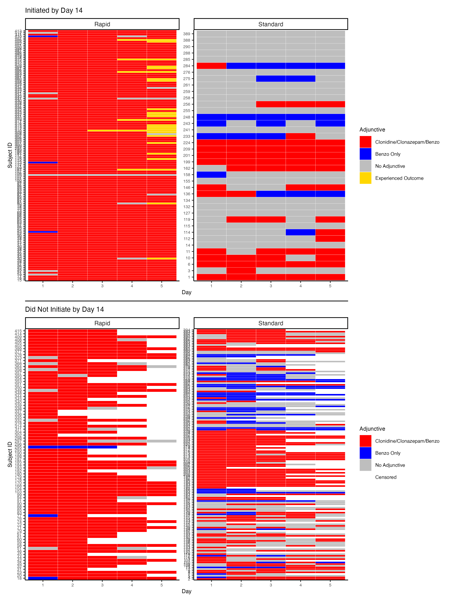

README for CTN97 Mediation (with Competing Risks)
================

### Summary

- Using CTN97 data, conduct a longitudinal mediation analysis with
  competing risks
- Variables of interest:
  - Exposure: randomization arm at baseline (rapid v. standard)
  - Mediator-outcome confounders: maximum COWS score on day t, missing
    indicator for maximum COWS score on day t $\in$ (1, 2, 3, 4, 5)
    - Previously, we also included an eligibility indicator (1 if
      eligible to receive additional medication) but we are now
      including this in the mediator
  - Mediators: adjunctive medication (clonidine, clonazepam, or
    benzodiazepines) on day t AND eligible for additional medication
    following max COWS on day t $\in$ (1, 2, 3, 4, 5)
  - Competing event: dropout or initiation of another MOUD on day t
    $\in$ (5, …, 14)
  - Outcome: initiation of XR-NTX on day t $\in$ (5, …, 14)

### Number of people receiving clonidine (≥1 mg), clonazepam (≥0.1 mg), or benzo (\>0 mg) and eligible for additional medication (did not receive more than maximum allowable dose in past 24 hours), by protocol

#### Table Form

- M = 1 indicates that the individual received at least one of clonidine
  (≥1 mg), clonazepam (≥0.1 mg), or benzo (\>0 mg) AND was eligible for
  additional medication (did not receive more than maximum allowable
  dose in past 24 hours)
- M = 0 indicates that the individual did NOT receive at least one of
  clonidine (≥1 mg), clonazepam (≥0.1 mg), or benzo (\>0 mg) OR was
  ineligible for additional medication (received more than maximum
  allowable dose in past 24 hours)

<table border="1">
<tr>
<th>
</th>
<th colspan="2">
t = 1
</th>
<th colspan="2">
t = 2
</th>
<th colspan="2">
t = 3
</th>
<th colspan="2">
t = 4
</th>
<th colspan="2">
t = 5
</th>
</tr>
<tr>
<td>
A = 1 (Rapid)
</td>
<td>
M = 1, 213 (94.7%)
</td>
<td>
M = 0, 12 (5.3%)
</td>
<td>
M = 1, 220 (99.1%)
</td>
<td>
M = 0,  2 (0.9%)
</td>
<td>
M = 1, 206 (96.1%)
</td>
<td>
M = 0,  8 (3.9%)
</td>
<td>
M = 1,  173  (93.0%)
</td>
<td>
M = 0,  13  (7.0%)
</td>
<td>
M = 1,  130  (92.9%)
</td>
<td>
M = 0,  10  (7.1%)
</td>
</tr>
<tr>
<td>
A = 0 (Standard)
</td>
<td>
M = 1, 119 (62.6%)
</td>
<td>
M = 0, 71 (37.4%)
</td>
<td>
M = 1, 117 (65.0%)
</td>
<td>
M = 0, 63 (35.0%)
</td>
<td>
M = 1, 105 (62.1%)
</td>
<td>
M = 0, 64 (37.9%)
</td>
<td>
M = 1,  77  (53.8%)
</td>
<td>
M = 0,  66  (46.2%)
</td>
<td>
M = 1,  69  (54.3%)
</td>
<td>
M = 0,  58  (45.7%)
</td>
</tr>
</table>

#### Plot Form

- Top row of panels shows dosing information for the first 5 days among
  those who initiated XR-NTX by day 14, stratified by protocol
- Bottom row of panels shows dosing information for the first 5 days
  among those who did NOT initiate XR-NTX by day 14, stratified by
  protocol

<figure>

<figcaption aria-hidden="true">Sequence Plot</figcaption>
</figure>

Who is getting benzos?

- Primarily those in the standard protocol and those who do not
  experience outcome

### What if we discretize our mediator?

- combine clonazepam and “other” benzodiazepines into a single scale,
  using common conversion scale [(VA
  scale)](https://www.healthquality.va.gov/guidelines/MH/sud/VA-DoD-SUD-CPG_Final_for-508_v3.pdf)

- M = 3 indicates that the individual received at least one of clonidine
  (≥0.1 mg) AND received benzo (≥3 mg) AND was eligible for additional
  medication (did not receive more than maximum allowable dose in past
  24 hours)

- M = 2 indicates that the individual received at least one of clonidine
  (≥0.1 mg) OR received benzo (≥2 mg) AND was eligible for additional
  medication (did not receive more than maximum allowable dose in past
  24 hours)

- M = 1 indicates that the individual received at least one of clonidine
  (≥0.1 mg) OR received ANY benzo (\>0 mg) AND was eligible for
  additional medication (did not receive more than maximum allowable
  dose in past 24 hours)

- M = 0 indicates that the individual did NOT receive at least one of
  clonidine (≥0.1 mg) or benzo (\>0 mg) OR was ineligible for additional
  medication (received more than maximum allowable dose in past 24
  hours)

| Arm      | Group_day_1 | count |
|:---------|------------:|------:|
| Rapid    |           0 |    12 |
| Rapid    |           1 |     9 |
| Rapid    |           2 |   153 |
| Rapid    |           3 |    51 |
| Standard |           0 |    71 |
| Standard |           1 |    33 |
| Standard |           2 |    73 |
| Standard |           3 |    13 |

| Arm      | Group_day_2 | count |
|:---------|------------:|------:|
| Rapid    |           0 |     2 |
| Rapid    |           1 |     1 |
| Rapid    |           2 |    83 |
| Rapid    |           3 |   136 |
| Rapid    |          NA |     3 |
| Standard |           0 |    63 |
| Standard |           1 |    27 |
| Standard |           2 |    77 |
| Standard |           3 |    13 |
| Standard |          NA |    10 |

| Arm      | Group_day_3 | count |
|:---------|------------:|------:|
| Rapid    |           0 |     8 |
| Rapid    |           1 |     4 |
| Rapid    |           2 |    60 |
| Rapid    |           3 |   134 |
| Rapid    |          NA |    19 |
| Standard |           0 |    64 |
| Standard |           1 |    30 |
| Standard |           2 |    68 |
| Standard |           3 |     7 |
| Standard |          NA |    21 |

| Arm      | Group_day_4 | count |
|:---------|------------:|------:|
| Rapid    |           0 |    13 |
| Rapid    |           1 |     3 |
| Rapid    |           2 |    54 |
| Rapid    |           3 |   116 |
| Rapid    |          NA |    39 |
| Standard |           0 |    66 |
| Standard |           1 |    23 |
| Standard |           2 |    49 |
| Standard |           3 |     5 |
| Standard |          NA |    47 |

| Arm      | Group_day_5 | count |
|:---------|------------:|------:|
| Rapid    |           0 |    10 |
| Rapid    |           1 |     5 |
| Rapid    |           2 |    52 |
| Rapid    |           3 |    73 |
| Rapid    |          NA |    85 |
| Standard |           0 |    58 |
| Standard |           1 |    15 |
| Standard |           2 |    51 |
| Standard |           3 |     3 |
| Standard |          NA |    63 |

#### Table Form (Daily Max COWS)

- M = 1 indicates that the individual received at least one of clonidine
  (≥1 mg), clonazepam (≥0.1 mg), or benzo (\>0 mg) AND was eligible for
  additional medication (did not receive more than maximum allowable
  dose in past 24 hours) AND max cows ≥ 3 (and not missing)
- M = 0 indicates that the individual did NOT receive at least one of
  clonidine (≥1 mg), clonazepam (≥0.1 mg), or benzo (\>0 mg) OR was
  ineligible for additional medication (received more than maximum
  allowable dose in past 24 hours) OR max cows \< 3 (or missing)

<table border="1">
<tr>
<th>
</th>
<th colspan="2">
t = 1
</th>
<th colspan="2">
t = 2
</th>
<th colspan="2">
t = 3
</th>
<th colspan="2">
t = 4
</th>
<th colspan="2">
t = 5
</th>
</tr>
<tr>
<td>
A = 1 (Rapid)
</td>
<td>
M = 1, 179 (79.6%)
</td>
<td>
M = 0, 46 (20.4%)
</td>
<td>
M = 1, 185 (83.3%)
</td>
<td>
M = 0,  37 (16.7%)
</td>
<td>
M = 1, 176 (85.4%)
</td>
<td>
M = 0,  30 (14.6%)
</td>
<td>
M = 1,  136  (73.1%)
</td>
<td>
M = 0,  50  (26.9%)
</td>
<td>
M = 1,  96  (68.6%)
</td>
<td>
M = 0,  44  (31.4%)
</td>
</tr>
<tr>
<td>
A = 0 (Standard)
</td>
<td>
M = 1, 82 (43.2%)
</td>
<td>
M = 0, 108 (56.8%)
</td>
<td>
M = 1, 85 (47.2%)
</td>
<td>
M = 0, 98 (52.8%)
</td>
<td>
M = 1, 71 (42.0%)
</td>
<td>
M = 0, 98 (58.0%)
</td>
<td>
M = 1,  50  (35.0%)
</td>
<td>
M = 0,  93  (65.0%)
</td>
<td>
M = 1,  40  (31.5%)
</td>
<td>
M = 0,  87  (68.5%)
</td>
</tr>
</table>
